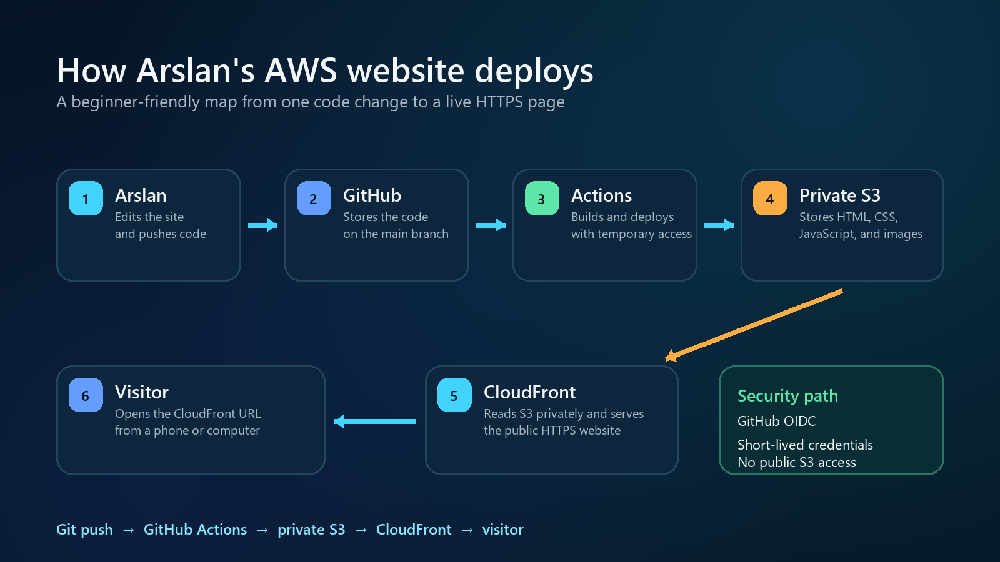

# Arslan AWS Lab ☁️

Arslan's first AWS project is a responsive static website deployed automatically from GitHub to a private Amazon S3 bucket and delivered worldwide through Amazon CloudFront.

## Live website

[https://d24mxhjix81zm4.cloudfront.net](https://d24mxhjix81zm4.cloudfront.net)

## How it works

1. Edit files inside `site/`.
2. Commit and push to the `main` branch.
3. GitHub Actions authenticates to AWS with OIDC and short-lived credentials.
4. The workflow builds the site, synchronizes it to the private S3 bucket, and clears the CloudFront cache.
5. CloudFront serves the latest version over HTTPS.



## Project structure

```text
site/                         Website source and SEO files
scripts/build_site.py         Replaces deployment URL placeholders
scripts/generate_graphics.py  Rebuilds the diagram and social image
infra/cloudformation.yml      AWS infrastructure as code
.github/workflows/deploy.yml  Automatic deployment workflow
```

## Security and cost choices

- The S3 bucket blocks all public access.
- CloudFront uses Origin Access Control to read the bucket privately.
- GitHub Actions uses OIDC, so AWS access keys are not stored in GitHub.
- The IAM role is limited to this bucket and this CloudFront distribution.
- CloudFront uses Price Class 100 and access logging is disabled.
- Only S3, CloudFront, IAM, and CloudFormation are used.

AWS pricing and free-tier eligibility depend on account age, region, and usage. This project is intentionally tiny, but no cloud deployment can promise a zero bill. Set an AWS Budget alert before sharing the site widely.

## Local preview

Build the site with Python and serve the generated folder:

```bash
python scripts/build_site.py --site-url http://localhost:8000
python -m http.server 8000 --directory dist
```

Then open `http://localhost:8000`.

## Rebuild graphics

```bash
python scripts/generate_graphics.py
```

## License

MIT
